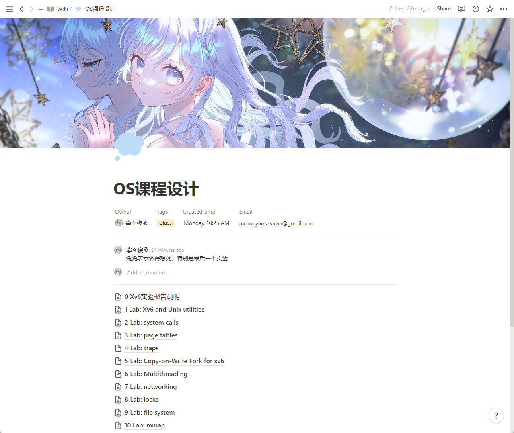

  

 🥕 如果兔兔的仓库对你有帮助的话点个⭐喵~ 

 🍒 If Tutu's repository is helpful to you, please give it a ⭐ meow~ 

 🍉 もしうさぎのリポジトリが役に立った場合は、⭐をぽちっとしてくださいにゃん~ 

# 简介

本仓库为同济大学软件学院 2023 春操作系统课程设计课程的 xv6-labs-2021 实验选题

课程要求见 requests 文件夹内容

xv6-labs-2021 的 10 个实验对应了本仓库的 10 个分支，可以查看完整代码和提交修改记录

# 详情

所有报告在 notion，预览如上🔗 [Reviews on notion](https://momoyamasawa.notion.site/OS-a1cdaf79f68245459ebe4b27f541fd26?pvs=4)

最近兔兔超喜欢这个[封面图](https://twitter.com/hdkjln/status/1679339270656659456?s=20)，妈妈是 **葉月透(@hdkjln)** ❤ 真的绝美绝美绝美！！！

